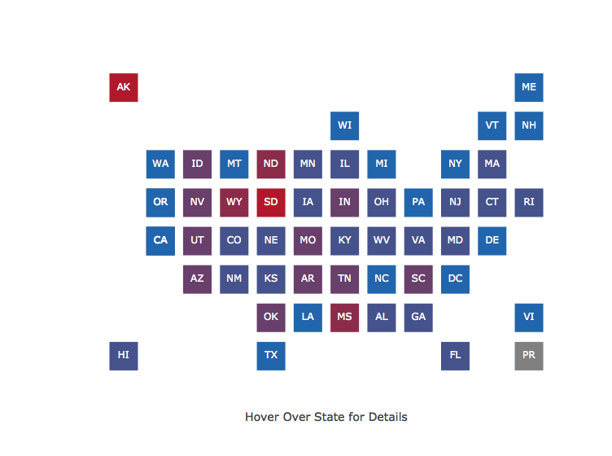

Women\_Candidates
================
Jenny Listman
2/5/2018

#### Interactive App To Visualize Women Runnning for State or Federal Offices

This project was created with data scraped from the website of the [Center for American Women in Politics](http://www.cawp.rutgers.edu) at [Rutgers University](https://www.rutgers.edu). The Center conducts research on women's participation in politics in America and maintains [a list](http://cawp.rutgers.edu/buzz-2018-potential-women-candidates-us-congress-and-statewide-elected-executive) of women who are or potentially will be running for US Congress and State offices.

The code scrapes and combines data from their lists of women candidates, cleans and creates new variables, and visualizes the data in an interactive `shiny` map and searchable data table using `plotly` and `DT` packages . **The [CAWP](http://www.cawp.rutgers.edu) states that their products or data are available for non-for-profit distribution as long as they are given credit (we are allowed to scrape their data table - thank you CAWP).**

See the app in action [here](https://jennylistman.shinyapps.io/WomenCandidates/). Read a blog about it [here](https://medium.com/@jblistman/an-app-to-search-for-women-running-for-office-in-2018-346f5a013ec9)

The design of the app was inspired by the [adavis](https://gokhan.shinyapps.io/adavis/) app from Gokhan Ciflikli

Load packages needed:

``` r
library(rvest)
library(tidyverse)
library(janitor)
library(shiny)
library(plotly)
library(filesstrings)
library(zoo)
library(ggpubr)
library(DT)
```

To turn the website into data:
1. Specify and read in the url for website with tables to be scraped.
2. Get HTML nodes with `rvest::html_nodes` and
3. parse table contents into dataframes with `rvest::html_table`.

``` r
url <- 'http://cawp.rutgers.edu/buzz-2018-potential-women-candidates-us-congress-and-statewide-elected-executive'

webpage <- read_html(url)

candidate_tables <- webpage %>%
        html_nodes("table") %>%
        html_table(fill = TRUE)
```

Viewing the tables we've got a list with 2 elements corresponding to 2 of the 3 tables on the website. Looking at the website, we can see that candidate\_tables\[\[1\]\] corresponds to special elections and candidate\_tables\[\[2\]\] corresponds to general elections. *This website has changed its format recently, so the number of tables has to be varified before updating app.*

``` r
glimpse(candidate_tables[[1]])
```

    ## Observations: 10
    ## Variables: 8
    ## $ State                    <chr> "AZ", "", "", "", "", "OH", "", "", "...
    ## $ Office                   <chr> "", "U.S. Rep.", "U.S. Rep.", "U.S. R...
    ## $ Dist.                    <int> NA, 8, 8, 8, NA, NA, 12, 12, 12, 12
    ## $ `Candidate Name & Party` <chr> "", "Brianna Westbrook (D)", "Hiral V...
    ## $ `Seat Status`            <chr> "", "O", "O", "O", "", "", "O", "O", ...
    ## $ `Filing\n\t\t\tDate`     <chr> "", "Filed", "Filed", "Filed", "", ""...
    ## $ `Primary\n\t\t\tDate`    <chr> "", "2/27/2018", "2/27/2018", "2/27/2...
    ## $ `Election\n\t\t\tDate`   <chr> "", "4/24/2018", "4/24/2018", "4/24/2...

``` r
glimpse(candidate_tables[[2]])
```

    ## Observations: 734
    ## Variables: 8
    ## $ State                    <chr> "AK", "", "", "", "AL", "", "", "", "...
    ## $ Office                   <chr> "", "Lt. Gov.", "Lt. Gov.", "", "", "...
    ## $ Dist.                    <chr> "", "", "", "", "", "", "", "", "", "...
    ## $ `Candidate Name & Party` <chr> "", "Lynn Gattis (R)", "Edie Grunwald...
    ## $ `General\n\t\t\tSeat`    <chr> "", "C", "C", "", "", "I", "C", "O", ...
    ## $ `Filing\n\t\t\tDate`     <chr> "", "6/1/2018", "6/1/2018", "", "", "...
    ## $ `Primary\n\t\t\tDate`    <chr> "", "8/21/2018", "8/21/2018", "", "",...
    ## $ `Election\n\t\t\tDate`   <chr> "", "11/6/2018", "11/6/2018", "", "",...

The special elections and general elections dataframes are formatted differently, so must be made compatible before combining. Change Dist. variable from numeric in the special elections table to character to match the general elections table. Use `janitor::clean_names` to remove spaces and special characters from variable names.

``` r
special_elec <- candidate_tables[[1]] %>%
        mutate(Dist. = as.character(Dist.)) %>% 
        mutate(Dist. = replace(Dist., Dist. == "8", "08")) %>% 
        clean_names() 
```

Combine the special elections and general elections dataframes and then clean things up. First rename one variable that has different names in each of these dataframes.

On the [CAWP website database](http://cawp.rutgers.edu/buzz-2018-potential-women-candidates-us-congress-and-statewide-elected-executive), state abbreviation appears once, one row above all entries for a given state. Spaces below it in that column are blank, until data for the next state appears. Use `zoo::na.locf` to replace blanks below a state abbreviation with the abbreviation above. In order for this function to work, the blanks first need to be changed to `NA`.

Remove special characters such as \* with `filesstrings::trim_anything` and remove all blank rows.

``` r
cols <- c(1,5)

elections <- candidate_tables[[2]] %>%
        clean_names() %>%
        rename(seat_status = general_seat) %>%
        bind_rows(special_elec) %>%
        mutate(state = replace(state, state == "", NA)) %>%
        transform(state = na.locf(state)) %>%
        subset(office != "") %>% 
        mutate(office = trim_anything(office, "*", "right")) %>%
        mutate_each(funs(factor(.)),cols)
```

Rename offices from abbreviations to full names. Some are not self-explanatory in their current state. In addition, some offices have more than one name/spelling/punctuation formatting (Comp, Comp., Comtr.) or have been misspelled.

``` r
elections$office <- fct_recode(elections$office,
                   `Commissioner of Agriculture` = "Agriculture", `Commissioner of Agriculture` = "Comm. Agri.",
                   `Attorney General` = "At. Gen.",`Attorney General`= "Atty. Gen.",
                   Auditor =  "Auditor",
                   `Chief Financial Officer` = "CFO",  
                   Comptroller = "Comp", Comptroller = "Comp.", Comptroller = "Comptr.",
                   Governor = "Govenor", Governor = "Governor",
                   `Insurance Commissioner` = "Insurance Comm.",
                   `Land Commissioner` = "Land",`Land Commissioner` = "Land Comm.",
                   `Lieutenant Governor` = "Lt. Gov.",
                   `Railroad Commissioner` = "Rail. Comm.",
                   `Superintendent of Public Instruction` = "S.P.I.",
                   `Secretary of State` = "Sec. St.",
                   `State Treasurer` = "St. Treas.",
                   `US Delegate` = "U.S. Del", `US Delegate` = "U.S. Del.",
                   `US Congressional Representative` = "U.S. Rep", `US Congressional Representative` = "U.S. Rep.",
                   `US Congressional Senator` = "U.S. Sen.")     
```

Candidate name and party affiliation are a single character variable. Separate these into two variables using `filestrings::str_elem` and `base::trimws`.

Some candidates in Minnesota have party listed as DFL. According to [Wikkepedia](https://en.wikipedia.org/wiki/Minnesota_Democratic–Farmer–Labor_Party): Minnesota Democratic–Farmer–Labor Party (DFL) is a social liberal political party in Minnesota affiliated with the Democratic Party. Recode these candidates as Democrats.

Territories that elect US Delegates and states with a small population that have one Federal Representative are listed as having district `AL`, to mean At-Large. Change district `AL` to `At-Large`. State-level offices have blanks for district variable. Change these to `State`.

``` r
elections <- elections %>%
        mutate(party = str_elem(candidate_name_party, -2)) %>%
        mutate(party = replace(party, party == "L", "D")) %>% 
        mutate(party = as.factor(party)) %>%
        mutate(candidate = trimws(str_before_first(candidate_name_party,"\\("), which = "both")) %>%
        mutate(candidate = gsub("(^\\s+)|(\\s+$)", "", candidate)) %>%
        mutate(dist = replace(dist, dist == "", "State")) %>% 
        mutate(dist = replace(dist, dist == "AL", "At-Large")) %>%
        mutate(dist = as.factor(dist)) %>%
        droplevels()
```

Make new variables for mapping and other possible visualizations: \# of women running in each state, \# and % running as Republican, \# and % running as Democrat, \# running for a given office.

Some states or territories have no women running at this time. Combine dataframe with a list of all state names and abbreviations to add missing states as rows with values `NA`. Remove states with no state abbreviation, since those are territories that won't show up on the `statebins` - style map. Capitalize variable names that will be included in the `DT` tab of the `shiny` app.

``` r
statenames <- read.csv("StateNamesAbbrevPostalCode.csv")

elections <- elections %>%
        add_count(state) %>%
        rename("Women Running" = n) %>%
        add_count(state, office) %>%
        rename(officeperstate = n) %>% 
        add_count(state, party) %>%
        rename(partyperstate = n) %>%
        add_count(state, office, dist) %>%
        rename(officeperdist = n) %>%
        merge(statenames, by.x = "state", by.y = "Postal.Code", all = TRUE) %>%
        mutate(percentparty = round(100*(partyperstate/`Women Running`), digits = 0)) %>%
        mutate(percentdem = ifelse(party == "D", percentparty, 100-percentparty)) %>%
        mutate(percentrepub = 100-percentdem) %>%
        subset(!(Abbreviation %in% c("","Guam"))) %>%
        rename(Office = office,Candidate = candidate,Party = party, District = dist) %>%
        droplevels()
```

`rvest::html_table` takes the text from a website's table, but doesn't get hyperlinks to elements in the table. I scraped links to candidate websites to add them to the candidate name variable in the dataframe.

Not all candidates in the CAWP list have a link and not all candidates that have links are from states (if they are from territories). The corresponding names are (re)scraped and these will be used to match the links back to the correct candidate in the `elections` dataframe. Rows missing state abbreviations will be removed (again).

``` r
candidate_names <- webpage %>%
        html_nodes(xpath = "//td/a") %>% html_text()

candidate_links <- webpage %>%
        html_nodes(xpath = "//td/a") %>% html_attr("href")

names_w_links <- as.data.frame(cbind(candidate_names, candidate_links)) %>%
        subset(candidate_names != "") %>%
        subset(candidate_links != "#list")
        
elections <- elections %>%
        merge(names_w_links,
              by.x = "Candidate", by.y = "candidate_names", all = TRUE) %>%
        subset(State != "")
```

For candidates that do have a website to which CAWP links, mutate the `elections$Candidate` variable to combine urls with candidate names in HTML code, to render as clickable links in the `shiny` app. For candidates without a link, don't alter the `elections$Candidate` variable.

``` r
elections$candidate_links <- as.character(elections$candidate_links)

for (x in 1:length(elections$Candidate)){
ifelse(is.na(elections$candidate_links)[x], 
       (elections$Candidate[x] <- elections$Candidate[x]), 
       (elections$Candidate[x] <- paste0("<a href='", elections$candidate_links[x], "'target='_blank'>", elections$Candidate[x],"</a>"))
        )
}
```

Save the file.

``` r
saveRDS(elections, "elections.rds")
```

Make a dataframe for the map: select a subset of needed variables and remove duplicates so there is only one row per state. Rename and recode variables to be readable for the map's hover text: change abbreviation `state` and full name `State` from factor to character variables and change `NA` values to `0`.

``` r
statedata <- elections[,c(2,11,15,18,19)] %>%
        unique() %>%
        rename("Percent Democrat" = "percentdem") %>%
        rename("Percent Republican" = "percentrepub") %>%
        mutate(state = as.character(state)) %>%
        mutate(State = as.character(State)) %>%
        mutate_all(funs(replace(., is.na(.), 0)))
```

To change continuous `dempercent` variable to categorical for mapping, bin and label it. Currently, `statebins` is not fully compatible with `plotly`, resulting in a non-interactive map. To get around that, adapt code from [Kenton Russell](http://bl.ocks.org/timelyportfolio/1cce2d1190460a7f1406945bdc02f4e1) to combine dataframe with `statebins` coordinates data `statebins:::state_coords` and plot it with no lines, tickmarks, axis labels, or grid to make a `plotly` map with working interactive hover info.

Rearrange column order to create hover text variable that will be made with `Map` `Reduce`.

The default `statebins` coordinates place Alaska in the bottom left of the plot, just above Hawaii. Intuitively, it should be placed in the upper left corner of the plot, northwest of an imaginary Canada. Change Alaska's `row` variable to `1` in dataframe to move it.

``` r
breaks <- c(0,20,40,60,80,100)

labels <- c("1-20% Dem", "21-40% Dem", "41-60% Dem", "61-80% Dem", "81-100% Dem")

statedata <- statedata %>%
        mutate(bins = cut(statedata$`Percent Democrat`, breaks, 
                          include.lowest = T, right=FALSE, labels = labels)) %>%
        mutate(bins = as.character(bins)) %>%
        mutate(bins = as.factor(ifelse(`Women Running` == 0, "0 Women Running", bins))) %>%
        merge(statebins:::state_coords[,-2], by.x = "state", by.y = "abbrev") %>%
        .[,c(3,2,4,5,1,6:8)] 

vars <- Map(
        function(x, y) paste0(x, ": ", y),
        names(statedata)[1:(ncol(statedata)-4)],
        statedata[,1:(ncol(statedata)-4)]
)

statedata <- statedata %>%
        mutate(txt = Reduce(function(x, y) paste0(x, "<br />", y), vars))

statedata[1,8] <- 1
```

Save the file.

``` r
saveRDS(statedata, "statedata.rds")
```

Make color palette with gray to reperesent states with no women currently running and 5 colors ranging from the traditional American political party red (Republican) to blue (Democrat) to represent the bins for percent Republican/Democrat among women candidates per state.

``` r
mapcolors <- c("#808080",get_palette(c("#b2182b","#2166ac"), 5))
```

The full `shiny` app code, including code for the `DT` section of the app, can be found in the `app.R` and `global.R` files in [this GitHub repo](https://github.com/JListman/Scrape_WomenRunning_CAWP).

Make a `plotly` - based `statebins` - style map for use in a `shiny` app.

The working `shiny` app can be found [here](https://jennylistman.shinyapps.io/WomenCandidates/).

``` r
y_Axis <- list(title = "",
                zeroline = FALSE,
                showline = FALSE,
                showticklabels = FALSE,
                showgrid = FALSE
                )
                
x_Axis <- list(title = "Hover Over State for Details",
               zeroline = FALSE,
               showline = FALSE,
               showticklabels = FALSE,
               showgrid = FALSE
                )
                
hovermap<- (plot_ly(statedata, x = ~col, y = ~-row) %>%
        add_markers(color = ~bins,
                    colors = mapcolors,
                    text = ~txt,
                    symbol = I("square"),
                    size = I(35),
                    hoverinfo = "text"
                    ) %>%
        add_text(text = ~state, color = I("white"), hoverinfo = "none") %>%
        layout(showlegend = FALSE, xaxis = x_Axis, yaxis = y_Axis)
)
    
hovermap            
```



Shiny app

``` r
library(shiny)
library(plotly)
library(DT)
library(shinythemes)

elections <- readRDS("elections.rds")
statedata <- readRDS("statedata.rds")

mapcolors <- c("#808080", "#B2182B", "#8D2B4B", "#693F6B", "#45528B", "#2166AC")

columns <- c("State", "Candidate", "District", "Office", "Party")

shinyApp(
        
ui <- fluidPage(theme = shinytheme("yeti"),
        titlePanel("Women Running for 2018 Congressional or State Office"),
        tabsetPanel(type = "tabs",
                    tabPanel("Map", align="center", plotlyOutput("statebins", width = "900px", height = "600px")),
                    tabPanel("Searchable Table",
                             fluidPage(
                             column(4,
                                     selectizeInput("Party", "Choose Party",
                                           c("Democrat" = "D",
                                             "Republican" = "R",
                                             "All" = "All"
                                             ),
                                           multiple = TRUE,
                                           selected = "D",
                                           width = '200px'
                                           )),
                             column(4,
                             selectizeInput("State", "Choose State(s)",
                                            c("All"= "All", levels(elections$State)),
                                            multiple = TRUE,
                                            selected = "California",
                                            width = '200px'
                                            )),
                             column(12,
                             DTOutput("data" )))
                    ),
                    tabPanel("About",
                             fluidPage(
                                     column(10,
                                            h3("An App to Search for Women Running for 2018 US Congressional or State Office"),
                                            p("I created this project to visualize a database maintained by the",
                                              a("Center for American Women in Politics",
                                                href = "http://www.cawp.rutgers.edu", target = "_blank"), "at",
                                              a("Rutgers University.", 
                                                href = "https://www.rutgers.edu", target = "_blank"), 
                                              "The Center conducts research on women's participation in politics in America and maintains", 
                                              a("a list", 
                                                href = "http://cawp.rutgers.edu/buzz-2018-potential-women-candidates-us-congress-and-statewide-elected-executive",
                                                target = "_blank"),
                                              "of women potentially running for US Congress and State offices. The data are current as of 2/5/18."),
                                            p("You can read more about", a("how", href = "https://medium.com/@jblistman", target = "_blank"),
                                              "or", a("why", href = "https://medium.com/@jblistman/an-app-to-search-for-women-running-for-office-in-2018-346f5a013ec9", target = "_blank"), 
                                              "I created this app on my blog."),
                                            p(a("R", href = "https://www.r-project.org", target = "_blank"),
                                              "code and details of data processing and visualization are available on",
                                              a("GitHub.", icon("github"), href = "https://github.com/JListman/Scrape_WomenRunning_CAWP", target = "_blank"),
                                              "Find me, Jenny Listman, on", a("Twitter", icon("twitter"),
                                                      href = "https://twitter.com/jblistman", target = "_blank"), "or",
                                              a("LinkedIn", icon("linkedin"), 
                                                href = "https://www.linkedin.com/in/jenniferlistman/", target = "_blank")),
                                            HTML("<br><br><br>")
                                            )
                                     )
                             )
                    ),
        tags$div(class="footer", checked=NA, tags$p("An interactive app to view data curated by the",
                a("CAWP", href = "http://www.cawp.rutgers.edu", target = "_blank")),
                tags$p(a("View code",icon("github"), href = "https://github.com/JListman/Scrape_WomenRunning_CAWP", target = "_blank"))
                 )
        ),


server <- function(input, output) {
   
        output$statebins <- renderPlotly({
                y_Axis <- list(
                        title = "", 
                        zeroline = FALSE,
                        showline = FALSE, 
                        showticklabels = FALSE, 
                        showgrid = FALSE
                )
                
                x_Axis <- list(
                        title = "", 
                        zeroline = FALSE,
                        showline = FALSE, 
                        showticklabels = FALSE, 
                        showgrid = FALSE
                )
                
                plot_ly(statedata, x = ~col, y = ~-row) %>%
                        add_markers(
                                color = ~bins,
                                colors = mapcolors,
                                text = ~txt,
                                symbol = I("square"), 
                                size = I(50),
                                hoverinfo = "text",
                                showlegend = FALSE
                        ) %>%
                        add_text(text = ~state, color = I("white"), hoverinfo = "none") %>%
                        add_annotations(
                                x= .5,
                                y= .95,
                                xref = "paper",
                                yref = "paper",
                                text = "Hover Over State For Details",
                                showarrow = F
                        ) %>%
                        layout(title = "", xaxis = x_Axis, yaxis = y_Axis)
                
        })
        
        output$data <- renderDT({
                if ("All" %in% input$State & "All" %in% input$Party)
                        candidates <- elections[, columns]
                else if ("All" %in% input$State & input$Party != "All")
                        elections[elections$Party %in% input$Party, columns]
                else if (input$State != "All" & "All" %in% input$Party)
                        elections[elections$State %in% input$State, columns]
                else
                        elections[elections$Party %in% input$Party & elections$State %in% input$State, columns]
                
        },
        escape = FALSE)
        
},

options = list(height = 500)
)
```
